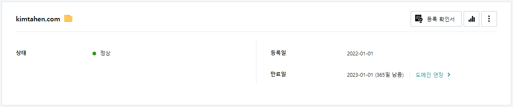
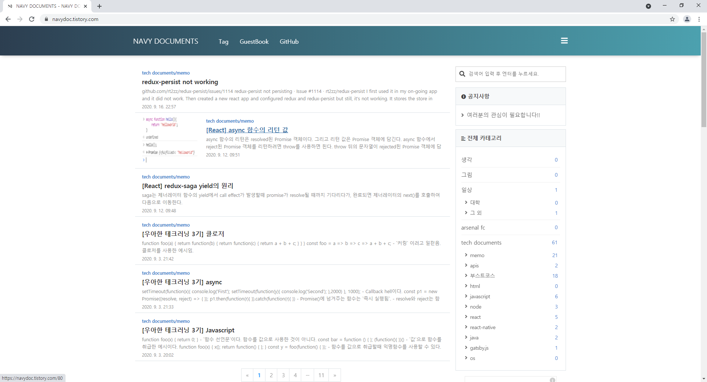

## 1
2022년 새해이다. 2020년 9월에 입대하였기에, 2021년 한 해는 통으로 군대에서 보냈다. 노력하지 말자고 하였던 건 아니었지만, 이것 저것 중구난방으로 하다보니 뚜렸한 실력 향상 같은건 기대도 할 수 없고 그저 경험만 쌓여갔을 뿐이다. 이걸 경험이라고 해야하는지도 잘 모르겠다. 내가 했던건 초보의 초보의 초보의 초보의 단계였기 때문이다. 그러다가 2022년 부터는 개발블로그도 열심히 써보고 정리도 하면서 좀 체계적으로 공부해보자는 생각이들어 일단 블로그를 만들어야했기에 도메인을 구매했다.(?) hostingkr에서 kimtahen.com 이라는 도메인을 1년 동안 사용하기로 결제를 했다. 다른 이상한 도메인, .xyz, .cloud 같은 것들은 현재 할인해서 막 900원, 5000원 이렇게 했지만 혹시나 내가 블로그를 잘 운영하고 구글에도 등록되고 했을 경우를 대비해서! 할인가 말고 원가가 .xyz, .cloud 보다 저렴한 .com을 선택했다.
 

## 2
지금 시점에서는 거의 2년이 되어가는 일이지만, 군대에 오기 전에 [https://navydoc.tistory.com](https://navydoc.tistory.com) 이라는 블로그를 운영했었다. 아래는 티스토리 블로그의 사진이다.
 

 
사람이 많이오는 편은 아니지만 하루에 80명 정도 방문했다. 그리 영양가 있는 글은 아니지만, 공부하는 과정에서 직접 마주한 문제들을 해결하는 법에 대해서 주로 적다보니 같은 문제를 구글링 하는 과정에서 유입된 듯 하다.

글을 읽어보면 상당히 불친절하다. 하긴 이때는 내가 이해하는 것만으로도 바빠서 블로그에 글을 자세히 써가며 설명하기엔 실력이 너무 부족했다. 지금도 마찬가지이지만,,, 그래도 자세히 쉽게 설명하는 연습을 해봐야겠다. 이런게 커뮤니케이션이 아닌가? 나중에 내가 읽었을 때 글만으로도 이해할 수 있도록 말이다.

## 3
전역이 한 달 앞으로 다가왔다. (드디어......) 사회로 다시 돌아가는 기대감이 들기도 하지만 동시에 불안감도 느낀다. 내가 해야 할 일을 잘 알면서도 잘 알지 못한다. 블로그를 작성하며 열심히 공부하는 것이 내가 해야할 일이기 때문에 일단은 여기서부터 시작해나가야겠다.
