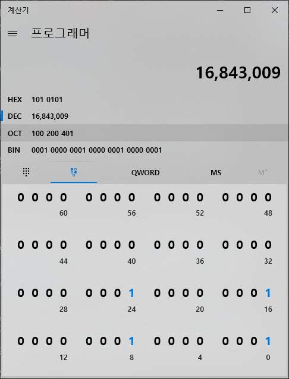

0으로 배열을 초기화 하는 방법은 간단하다. 아래와 같이 배열을 생성할때 0으로 초기화해주면 된다.
```cpp
#include <iostream>
#include <algorithm>
using namespace std;
int main(){
    int arr_1d[10] = {0,};
    int arr_2d[10][10] = {0,}; //{{0,}} 도 가능하다.
    return 0;
}
```
하지만 문제는 특정 값으로 한번에 초기화 할 경우이다. 예를 들어 배열을 5로 초기화 하고 싶을 때 위의 방법에서 0대신 5를 넣는다고 한번에 초기화 되질 않는다. 그래서 다음과 같은 방법이 있다.
<br/>

## 1. 반복문으로 배열 초기화
가장 많이 사용하는 방법이다. 하지만 타이핑하는데 시간이 조금 걸린다.
### 1차원 배열 초기화
```cpp
#include <iostream>
#include <algorithm>
using namespace std;
int main(){
    int arr_1d[10];
    for(int i = 0; i<10; i++)
        arr_1d[i] = 0;
    return 0;
}
```
### 2차원 배열 초기화
```cpp
#include <iostream>
#include <algorithm>
using namespace std;
int main(){
    int arr_2d[10][10];
    for(int i = 0; i<10; i++)
        for(int j = 0; j<10; j++)
            arr_2d[i][j] = 0;
    return 0;
}
```

## 2. std::fill 함수 사용
fill 함수를 사용하면 쉽게 초기화 할 수 있다. [cppreference](https://en.cppreference.com/w/cpp/algorithm/fill) 에 나와있는 함수의 정의는 다음과 같다.
```cpp
template< class ForwardIt, class T >
void fill(ForwardIt first, ForwardIt last, const T& value)
{
    for (; first != last; ++first) {
        *first = value;
    }
}
```
first부터 last까지 순회하면서 3번째 인자로 주어진 value를 그 주소값에 집어 넣는다.

### 1차원 배열 초기화
```cpp
#include <iostream>
int main(){
    int arr_1d[10];
    fill(&arr_1d[0], &arr_1d[10],5);
    return 0;
}
```
첫번째 인자에는 배열의 시작 주솟값을 넣어주고, 두번째 인자에는 **마지막 주솟값 + 1**을 넣어주어야 한다. 왜냐하면 위의 정의에서 first가 last와 주솟값이 같으면 종료되는 조건을 가지고 있기 때문이다.

### 2차원 배열 초기화
```cpp
#include <iostream>
int main(){
    int arr_2d[10][10];
    fill(&arr_2d[0][0], &arr_2d[9][10], 5);
    return 0;
}
```
2차원이지만 결국에는 각을row가 한줄로 쭉 이어져 있는 것과 마찬가지이므로 1차원 배열과 같이 시작 주솟값과 **마지막 주솟값 + 1**을 넣어주어야 한다. [9][10] 인 이유는 마지막 주솟값은 [9][9] 인데 여기서 한 칸을 더 가기 때문이다. 

## 3. memset 함수 이용 
배열을 초기화 할때 memset을 사용하면 for문으로 직접 순회하며 초기화하는 것 보다 속도면에서 장점이 있다. memset 함수를 이용하기 위해서는 cpp에서 cstring, c에서는 string.h 헤더 파일을 포함 해야 한다. 아래는 [cppreference](https://en.cppreference.com/w/cpp/string/byte/memset) 의 memset의 정의 이다.
```cpp
void* memset( void* dest, int ch, std::size_t count );
```
cppreference 에서는 첫줄에 아래와 같이 쓰여 있다.
> Converts the value ch to unsigned char and copies it into each of the first count characters of the object pointed to by dest.

memset의 두번째 인자는 int형인데, memset에서 int형을 unsigned char형으로 변환한 뒤 dest에 복사한다고 한다. 즉 4byte -> 1byte 로 변환되어 복사가 된다. 그도 그럴 것이 이 memset함수는 cstring, string.h와 같은 string관련 함수이다. string은 기본적으로 1바이트 char형을 사용하므로, int형 을 복사할 이유가 없는 것이다. 또한 1byte 가 단위이므로 만약 배열이 4바이트 int형이라면 한 index에 1byte unsigned char 이 4번 반복해서 나열된 뒤 들어가게 된다.

```cpp
int arr[4] = {0};
memset(arr, 1, sizeof(arr));
```
예를 들어 위와 같이 memset을 호출 했다고 해보자. arr[0] 은 int형 이므로 4byte이다. 그리고 처음에 0으로 초기화 했기 때문에 2진수로 나타내면 **00000000/00000000/00000000/00000000** 이라고 할 수 있다. 이전에 memset은 1byte로 변환하여 복사한다고 하였다. 그러므로 1byte로 1을 나타내면 **00000001** 이고 이를 arr[0] 에 memset으로 넣게 되면 **00000001/00000001/00000001/00000001** 이렇게 4번 반복되어 들어간다. 이를 다시 int형으로 읽으면 아래와 같이 16,843,009 라는 결과가 나온다. 즉 모든 배열의 원소가 16843009로 초기화 됨을 의미한다.

 

결론적으로 0 또는 -1로 초기화 할 때만 memset을 사용하는 것이 안전하다. 0은 이진수로 **00000000**(1byte, unsigned char) 이고 1은 이진수로 **11111111**(1byte, unsigned char) 이다. 이 둘의 공통점은 모든 숫자가 같다는 것이다. 따라서 4번 반복하여 int형으로 읽어도 값이 변함이 없기 때문에 안전하다.

### 1차원 배열 초기화
```cpp
#include <iostream>
#include <cstring>
using namespace std;
int main(){
    int arr_1d[10];
    memset(arr_1d, -1, sizeof(arr_1d));
    return 0;
}
```

### 2차원 배열 초기화
```cpp
#include <iostream>
#include <cstring>
using namespace std;
int main(){
    int arr_2d[10][10];
    memset(arr_2d, -1, sizeof(arr_2d));
    return 0;
}
```

iostream에 cstring이 포함되어 있는지는 잘 모르겟지만, 스마트폰 termux gcc 에서는 cstring을 포함하지 않아도 컴파일이 잘 된다.

