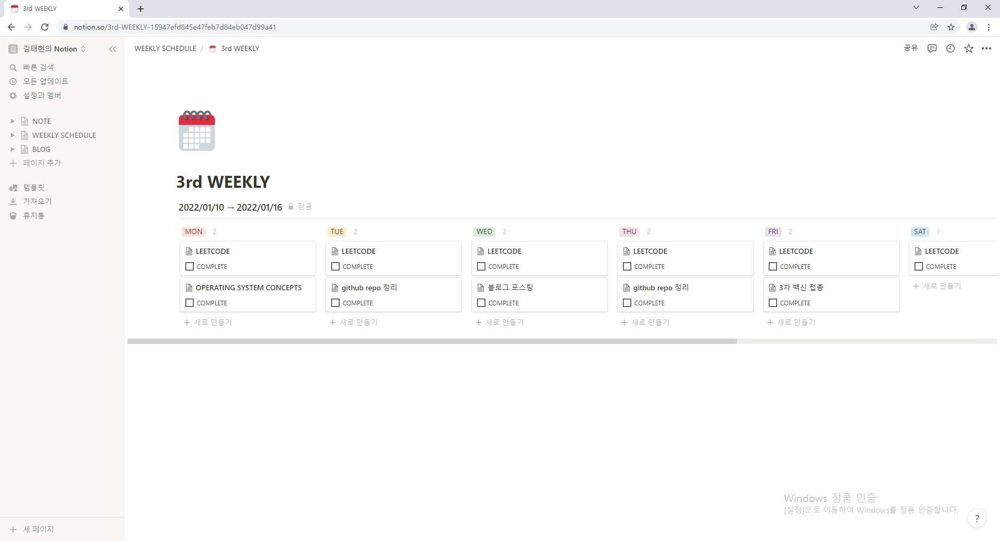
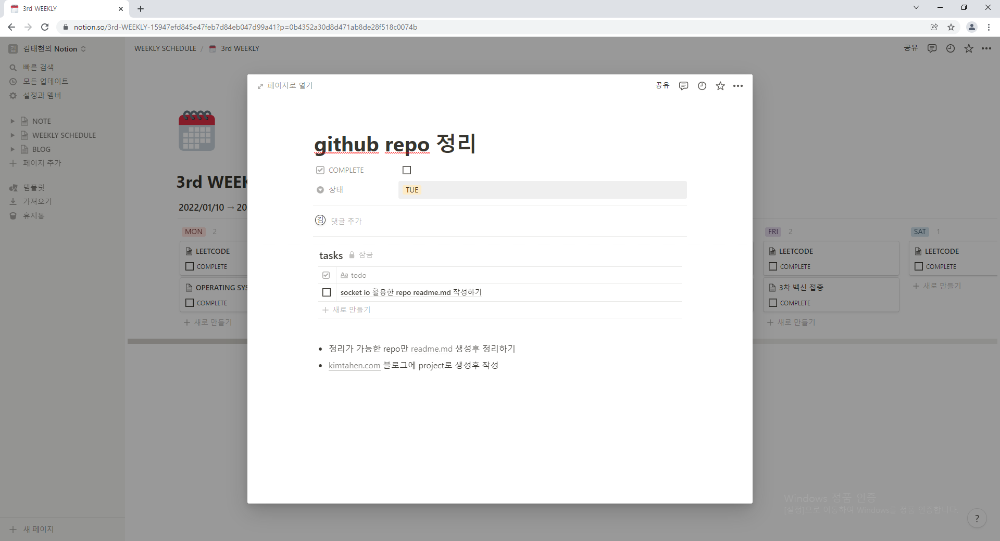

## 1 : 처음으로 노션을 사용해보다 == 처음으로 계획을 해보다?
입대 전에도 노션이 뭔지는 알고 있었는데, 그냥 협업이나 메모장 정도로 생각했지 굉장히 **생산성** 있는 도구인지는 몰랐다. 어느날 **이연** 님의 유튜브 영상 중 하나인 [https://youtu.be/HwgGqHrtOV4](https://youtu.be/HwgGqHrtOV4) 에서 노션을 사용하시는 걸 보고 나도 해보자! 하는 생각이 들어 행동으로 옮기게 되었다. 무엇보다도 멋있는 건 따라해보고 싶은 욕심에 시작하게 되었다고 볼 수 있다.ㅎㅎ 

평소 나는 계획하고 행동하는 편이 아니다. 그렇다고 해서 생각없이 마감이 다가오면 벼락치기로 시작하지는 않고, 대충 머릿속에 언제언제 하자 정도의 두루뭉실한 계획만 해놓는 편이다. 마침 노션을 시작한 김에 이런 지난날을 돌이켜보며 이제부터는 계획하고 실행에 옮기자는 다짐을 하였다.

## 2
노션을 처음 가입하면 아무 것도 없는 빈 화면 뿐이다. 그래서 어제 저녁 내내 그리고 오늘 오전 시간 동안 유튜브와 블로그를 막 찾아보았다. 

일단은 템플릿이 굉장히 많다. 그만큼 노션이 생산적인 업무에서는 정말 좋다는 것이 사람들 사이에서 입증이 된 셈이다. 그 중에서도 **weekly planner** 가 가장 괜찮아 보였다. 처음에는 다른 분이 만들어 놓은 템플릿을 사용하려 했는데 디자인적 요소가 많이 들어가 있기도 하고 기본적인 기능들로 깔끔하게 사용하고 싶은 마음에, 내가 직접 만들어 보기로 했다.

만드는 것 어렵지 않았다. 처음하는 거라 익숙하지 않아서 시간이 오래 걸렸을 뿐이다. 결국 아래와 같이 제작했다.

"월 화 수 목 금 토 일" 을 한주로 생각하고 각 주차마다 서순을 부여해서 페이지로 저장하기로 했다. 

각 요일의 계획을 클릭하면 아래와 같이 페이지가 뜬다. 페이지 내에서는 tasks 라는 템플릿을 만들어 두어 세부 계획을 생성하도록 만들어 두었다.

## 3
계획적으로 살아가면 한정된 시간을 더욱 알차게 사용할 수 있을 것이다. 내가 알고 있는 내 자신이 하는 가장 큰 착각은 "계획을 하지 않아야 한정된 시간을 더욱 밀도 있게 사용할 수 있다"이다. 그냥 이 문장만 읽어보더라도 모순 그 자체이다. 이런 모순을 해결하기 위해 노션을 잘 활용해보려 한다.